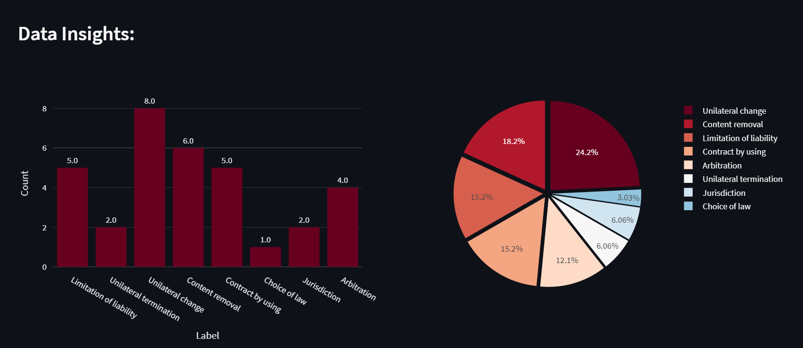
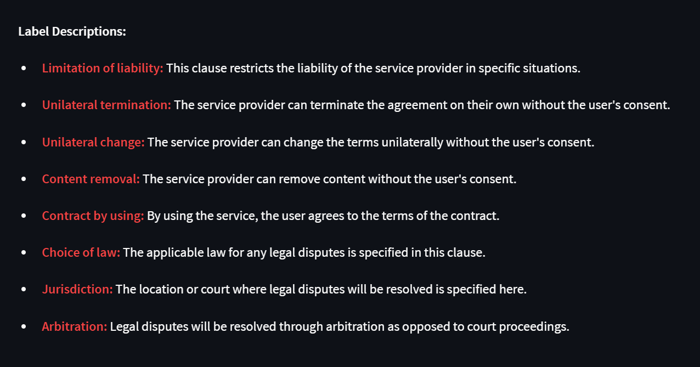
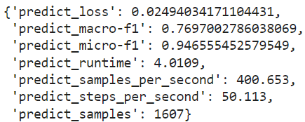

# UDOT-Precursor
## Unfairness detection of Terms of Services

# Terms & Conditions Analysis Tool

## Overview

This tool is designed to analyze and provide insights into the terms and conditions of online services. It uses natural language processing (NLP) to classify sentences within the terms and conditions and provides valuable data insights.

## How to Use

1. **Enter the Terms and Conditions:**
   - Paste or type the terms and conditions into the text area provided.

2. **Submit:**
   - Click the "Submit" button to initiate the analysis.

3. **Analysis:**
   - The tool processes the text and classifies sentences based on predefined labels.
   - The analysis results include identified labels and sentences for each category.

4. **Data Insights:**
   - Data insights are provided in both bar chart and pie chart formats.
   - The charts visually represent the distribution of identified labels within the terms and conditions.

5. **Label Descriptions:**
   - Descriptions of each label used in the analysis are provided for user reference.

## Screenshots

### Frontend of the App


## Process-Flow of the App


### Exploratory Data Analysis (EDA) in the App


### Identified Labels


## Requirements

- Python 3.x
- Required Python packages are listed in `requirements.txt`.

## Model Information

- The model is finetuned from "legal-bert-base-uncased," a custom BERT architecture designed for the legal domain.
- The model is trained on a dataset of 9.41k sentences for multi-class classification task dataset consisting of terms and conditions of popular online services with 8 classes.
- The model is hosted on Hugging Face and accessed via inference API.

### Evaluation and Prediction Results



## Configuration

- The app configuration is defined in `app_config.py`.
- API configuration is in `api_config.py`.
- Classification functions are implemented in `classification.py`.
- Label configurations are defined in `label_config.py`.

## Usage

1. Install the required dependencies:
   ```bash
   pip install -r requirements.txt

2. Run the app:
   ```bash
   streamlit run app.py
